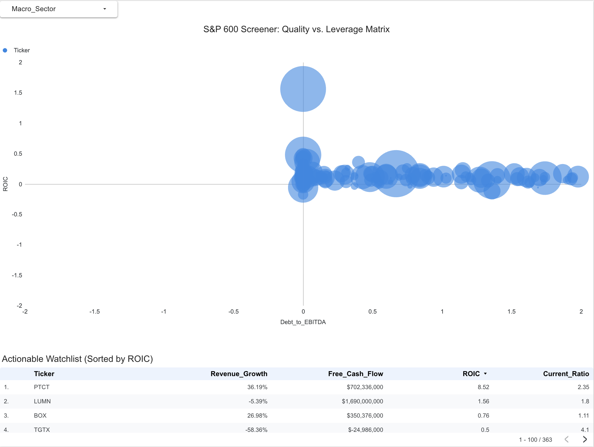

# Quantitative Stock Screener & BI Dashboard (S&P 600)

## Project Overview
This project is an end-to-end data engineering and financial analysis pipeline. It extracts raw XBRL financial data directly from the SEC's EDGAR database, calculates advanced fundamental metrics, and visualizes the results to identify high-quality, actionable investments within the S&P 600 Small Cap index.

The goal of this screener is to separate cash-generating, highly efficient businesses from cash-burning, over-leveraged companies using a strict "Quality vs. Leverage" matrix.

### Live Dashboard
Click the image below to interact with the live S&P 600 Screener:

*Note: The dataset is intentionally filtered to isolate actionable equities. Companies with missing, incomplete, or non-standard SEC filings were dropped to ensure strict data integrity.*

---

## The Tech Stack
* **Python (Pandas, Requests):** Used for REST API requests, JSON parsing, and dataframe manipulation.
* **SEC EDGAR API:** The sole source of truth for raw financial data (10-K filings).
* **Looker Studio:** Used for Business Intelligence (BI) visualization and dynamic filtering.

---

## The ETL Pipeline & Repository Files

### 1. The Engine (`StockScreener.py`)
This script reads the input file (`sp-600-with-ciks.csv`), pings the SEC API to pull raw JSON data, and dynamically searches for specific US-GAAP tags to calculate:
* **Return on Invested Capital (ROIC):** To measure operational efficiency.
* **Free Cash Flow (FCF):** To verify actual cash generation vs. accounting net income.
* **Debt-to-EBITDA & Current Ratio:** To stress-test solvency and liquidity.
* **Revenue & Earnings Growth:** To confirm the business is actively scaling.

### 2. The Outputs
The Python script cleans and formats the messy JSON data into two ready-to-use CSV files:
* `tableau_perfect_data.csv`: The finalized, strictly-typed dataset formatted specifically for BI tools. 
* `new_companies_watch_list.csv`: A raw, filtered hit list of the top companies that survived the screener.

### 3. The Dashboard (Looker Studio)
The `tableau_perfect_data.csv` is loaded into a dynamic Looker Studio dashboard, featuring a scatter plot matrix designed to isolate companies in the "Magic Quadrant" (High ROIC + Low Debt).

---

## How to Run Locally
1. Clone the repository.
2. Ensure you have the required libraries installed: `pip install pandas requests`.
3. Update the `email_contact` parameter in `StockScreener.py` to comply with SEC API rate-limiting rules.
4. Run `python StockScreener.py` to generate the output CSV files.
   
